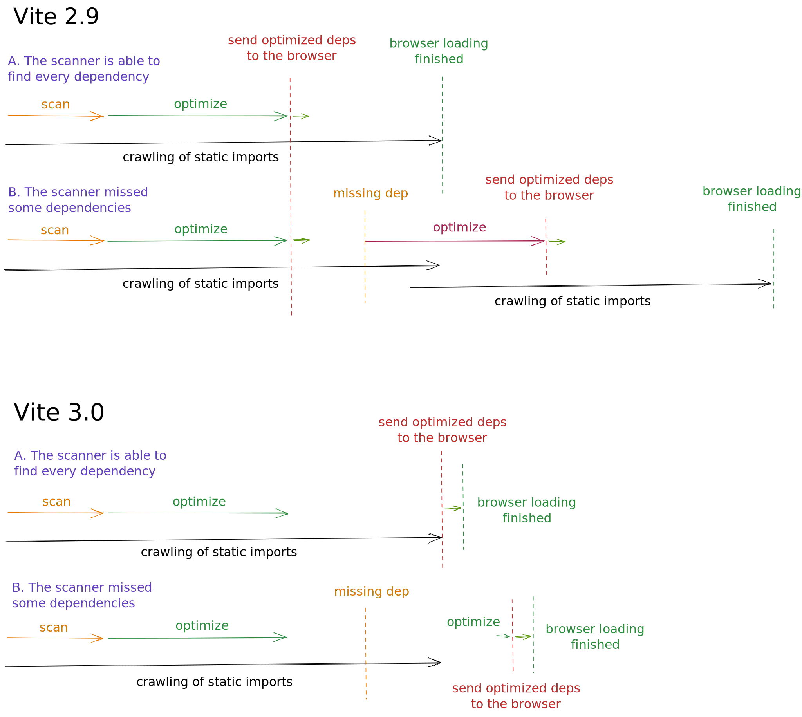
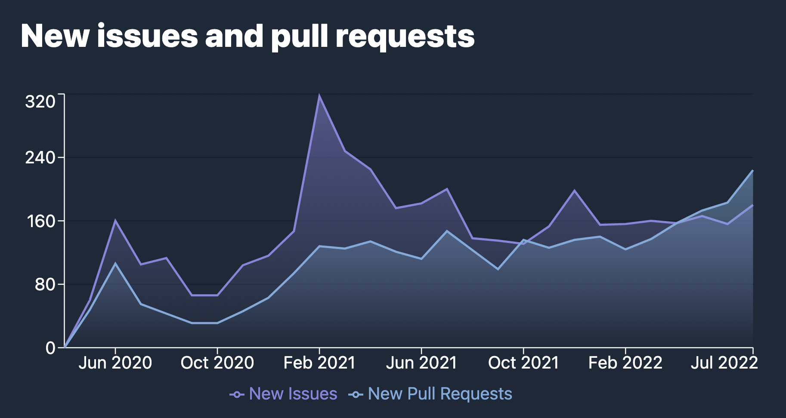

# Vite 3.0 вышел!

_23 июля 2022 г._ - Ознакомьтесь с [объявлением о Vite 4.0](./announcing-vite4.md)

В феврале прошлого года [Эван Ю](https://twitter.com/youyuxi) выпустил Vite 2. С тех пор его принятие непрерывно росло, достигнув более 1 миллиона загрузок npm в неделю. После выпуска быстро сформировалась обширная экосистема. Vite стимулирует возобновленную гонку инноваций в веб-фреймворках. [Nuxt 3](https://v3.nuxtjs.org/) использует Vite по умолчанию. [SvelteKit](https://kit.svelte.dev/), [Astro](https://astro.build/), [Hydrogen](https://hydrogen.shopify.dev/) и [SolidStart](https://docs.solidjs.com/quick-start) — все они созданы с использованием Vite. [Laravel теперь решил использовать Vite по умолчанию](https://laravel.com/docs/9.x/vite). [Vite Ruby](https://vite-ruby.netlify.app/) показывает, как Vite может улучшить Rails DX. [Vitest](https://vitest.dev) делает успехи в качестве альтернативы Jest на основе Vite. Vite стоит за новыми функциями тестирования компонентов [Cypress](https://docs.cypress.io/guides/component-testing/writing-your-first-component-test) и [Playwright](https://playwright.dev/docs/test-components), Storybook имеет [Vite в качестве официального сборщика](https://github.com/storybookjs/builder-vite). И [список можно продолжать](https://patak.dev/vite/ecosystem.html). Сопровождающие большинства этих проектов участвовали в улучшении самого ядра Vite, тесно сотрудничая с [командой] Vite(https://vite.dev/team) и другими участниками.


Сегодня, спустя 16 месяцев после запуска v2, мы рады объявить о выпуске Vite 3. Мы решили выпускать новый основной Vite не реже одного раза в год, чтобы соответствовать [Node.js EOL](https://nodejs.org/en/about/releases/), и воспользуйтесь возможностью регулярно просматривать API Vite с коротким путем миграции для проектов в экосистеме.

Быстрые ссылки:

- [Документация](/)
- [Руководство по миграции](https://v3.vite.dev/guide/migration.html)
- [Журнал изменений](https://github.com/vitejs/vite/blob/main/packages/vite/CHANGELOG.md#300-2022-07-13)

Если вы новичок в Vite, мы рекомендуем прочитать [Руководство по Vite](https://vite.dev/guide/why.html). Затем ознакомьтесь с [Руководством по началу работы](https://vite.dev/guide/) и [Руководством по функциям](https://vite.dev/guide/features), чтобы узнать, что Vite предоставляет из коробки. Как обычно, вклад приветствуется на [GitHub](https://github.com/vitejs/vite). Более [600 соавторов](https://github.com/vitejs/vite/graphs/contributors) помогли улучшить Vite на данный момент. Следите за обновлениями в [Twitter](https://twitter.com/vite_js) или присоединяйтесь к обсуждениям с другими пользователями Vite на нашем [сервере чата Discord](http://chat.vite.dev/).

## Новая Документация

Перейдите на [vite.dev](https://vite.dev), чтобы насладиться новой документацией v3. Vite теперь использует новую тему по умолчанию [VitePress](https://vitepress.vuejs.org) с потрясающим темным режимом среди других функций.

[](https://vite.dev)

Несколько проектов в экосистеме уже перешли на него (смотрите [Vitest](https://vitest.dev), [vite-plugin-pwa](https://vite-plugin-pwa.netlify.app/) и сам [VitePress](https://vitepress.vuejs.org/)).

Если вам нужен доступ к документации Vite 2, она останется онлайн по адресу [v2.vite.dev](https://v2.vite.dev). Также есть новый поддомен [main.vite.dev](https://main.vite.dev), где автоматически развертывается каждый коммит в основную ветку Vite. Это полезно при тестировании бета-версий или участии в разработке ядра.

Также теперь есть официальный испанский перевод, который был добавлен к предыдущим китайским и японским переводам:

- [简体中文](https://cn.vite.dev/)
- [日本語](https://ja.vite.dev/)
- [Español](https://es.vite.dev/)

## Создание стартовых шаблонов Vite

[create-vite](/guide/#trying-vite-online) стали отличным инструментом для быстрого тестирования Vite с вашим любимым фреймворком. В Vite 3 все шаблоны получили новую тему в соответствии с новыми документами. Откройте их онлайн и начните играть с Vite 3 прямо сейчас:

<div class="stackblitz-links">
<a target="_blank" href="https://vite.new"></a>
<a target="_blank" href="https://vite.new/vue"></a>
<a target="_blank" href="https://vite.new/svelte"></a>
<a target="_blank" href="https://vite.new/react"></a>
<a target="_blank" href="https://vite.new/preact"></a>
<a target="_blank" href="https://vite.new/lit"></a>
</div>

<style>
.stackblitz-links {
  display: flex;
  width: 100%;
  justify-content: space-around;
  align-items: center;
}
@media screen and (max-width: 550px) {
  .stackblitz-links {
    display: grid;
    grid-template-columns: 1fr 1fr 1fr;
    width: 100%;
    gap: 2rem;
    padding-left: 3rem;
    padding-right: 3rem;
  }
}
.stackblitz-links > a {
  width: 70px;
  height: 70px;
  display: grid;
  align-items: center;
  justify-items: center;
}
.stackblitz-links > a:hover {
  filter: drop-shadow(0 0 0.5em #646cffaa);
}
</style>

Тема теперь является общей для всех шаблонов. Это должно помочь лучше представить возможности этих стартеров в качестве минимальных шаблонов для начала работы с Vite. Для более полных решений, включая линтинг, настройку тестирования и другие функции, существуют официальные шаблоны на базе Vite для некоторых фреймворков, таких как [create-vue](https://github.com/vuejs/create-vue) и [create-svelte](https://github.com/sveltejs/kit). Существует поддерживаемый сообществом список шаблонов на [Awesome Vite](https://github.com/vitejs/awesome-vite#templates).

## Улучшения для разработчиков

### Vite CLI

<pre style="background-color: var(--vp-code-block-bg);padding:2em;border-radius:8px;max-width:100%;overflow-x:auto;">
  <span style="color:lightgreen"><b>VITE</b></span> <span style="color:lightgreen">v3.0.0</span>  <span style="color:gray">ready in <b>320</b> ms</span>

  <span style="color:lightgreen"><b>➜</b></span>  <span style="color:white"><b>Local</b>:</span>   <span style="color:cyan">http://127.0.0.1:5173/</span>
  <span style="color:green"><b>➜</b></span>  <span style="color:gray"><b>Network</b>: use --host to expose</span>
</pre>

Помимо эстетических улучшений интерфейса командной строки, вы заметите, что порт сервера разработки по умолчанию теперь равен 5173, а сервер предварительного просмотра прослушивает порт 4173. Это изменение гарантирует, что Vite избежит конфликтов с другими инструментами.

### Улучшенная стратегия подключения WebSocket

Одной из болевых точек Vite 2 была настройка сервера при работе за прокси. Vite 3 изменяет схему подключения по умолчанию, поэтому в большинстве сценариев она работает «из коробки». Все эти настройки теперь тестируются как часть Vite Ecosystem CI через [`vite-setup-catalogue`](https://github.com/sapphi-red/vite-setup-catalogue).

### Улучшения холодного запуска

Vite теперь избегает полной перезагрузки во время холодного запуска, когда плагины внедряют импорт при сканировании исходных статически импортированных модулей ([#8869](https://github.com/vitejs/vite/issues/8869)).

<details>
  <summary><b>Нажмите, чтобы узнать больше</b></summary>

В Vite 2.9 и сканер, и оптимизатор работали в фоновом режиме. В лучшем случае, когда сканер находил все зависимости, при холодном запуске не требовалось перезагрузки. Но если сканер пропускал зависимость, требовалась новая фаза оптимизации, а затем перезагрузка. Vite удалось избежать некоторых из этих перезагрузок в версии 2.9, поскольку мы определили, совместимы ли новые оптимизированные фрагменты с теми, которые были в браузере. Но если было общие зависимости, подчанки могли измениться, и требовалась перезагрузка, чтобы избежать дублирования состояния. В Vite 3 оптимизированные отсылки не передаются в браузер до тех пор, пока не будет выполнено сканирование статического импорта. Фаза быстрой оптимизации выдается, если отсутствует деп (например, внедренный плагином), и только после этого отправляются связанные зависимости. Таким образом, в этих случаях перезагрузка страницы больше не требуется.

</details>



### import.meta.glob

Поддержка `import.meta.glob` была переписана. Читайте о новых функциях в [Руководстве по импорту Glob](/guide/features.html#glob-import):

[Multiple Patterns](/guide/features.html#multiple-patterns) можно передавать в виде массива

```js
import.meta.glob(['./dir/*.js', './another/*.js'])
```

Теперь поддерживаются [Negative Patterns](/guide/features.html#negative-patterns) (с префиксом `!`), чтобы игнорировать некоторые определенные файлы

```js
import.meta.glob(['./dir/*.js', '!**/bar.js'])
```

[Named Imports](/guide/features.html#named-imports) можно указать, чтобы улучшить встряхивание дерева

```js
import.meta.glob('./dir/*.js', { import: 'setup' })
```

[Custom Queries](/guide/features.html#custom-queries) можно передавать для прикрепления метаданных

```js
import.meta.glob('./dir/*.js', { query: { custom: 'data' } })
```

[Eager Imports](/guide/features.html#glob-import) теперь передается как флаг

```js
import.meta.glob('./dir/*.js', { eager: true })
```

### Согласование импорта WASM с будущими стандартами

API импорта WebAssembly был пересмотрен, чтобы избежать конфликтов с будущими стандартами и сделать его более гибким:

```js
import init from './example.wasm?init'

init().then((instance) => {
  instance.exports.test()
})
```

Узнайте больше в [руководстве по веб-сборке](/guide/features.html#webassembly)

## Улучшения сборки

### Сборка ESM SSR по умолчанию

Большинство фреймворков SSR в экосистеме уже использовали сборки ESM. Поэтому Vite 3 делает ESM форматом по умолчанию для сборок SSR. Это позволяет нам оптимизировать предыдущие [эвристики экстернализации SSR](https://vite.dev/guide/ssr.html#ssr-externals), экстернализуя зависимости по умолчанию.

### Улучшенная относительная базовая поддержка

Vite 3 теперь правильно поддерживает относительную базу (используя `base: ''`),, позволяя развертывать созданные активы на разных базах без повторной сборки. Это полезно, когда база неизвестна во время сборки, например, при развертывании в сетях с адресацией содержимого, таких как [IPFS](https://ipfs.io/).

## Экспериментальные функции

### Детальный контроль встроенных путей активов (экспериментально)

Существуют и другие сценарии деплоя, в которых этого недостаточно. Например, если сгенерированные хэшированные активы необходимо развернуть в другой CDN, отличной от общедоступных файлов, требуется более точный контроль над генерацией пути во время сборки. Vite 3 предоставляет экспериментальный API для изменения созданных путей к файлам. Смотрите [Расширенные базовые параметры сборки](/guide/build.html#advanced-base-options) для получения дополнительной информации.

### Оптимизация Esbuild Deps во время сборки (экспериментально)

Одно из главных различий между временем разработки и сборки заключается в том, как Vite обрабатывает зависимости. Во время сборки [`@rollup/plugin-commonjs`](https://github.com/rollup/plugins/tree/master/packages/commonjs) используется для импорта зависимостей только CJS (например, React). При использовании сервера разработки вместо этого используется esbuild для предварительной сборки и оптимизации зависимостей, а встроенная схема взаимодействия применяется при преобразовании пользовательского кода, импортирующего зависимости CJS. Во время разработки Vite 3 мы внесли изменения, необходимые для того, чтобы также разрешить использование [esbuild для оптимизации зависимостей во время сборки](https://v3.vite.dev/guide/migration.html#using-esbuild-deps-optimization-at-build-time). [`@rollup/plugin-commonjs`](https://github.com/rollup/plugins/tree/master/packages/commonjs) можно будет избежать, что позволит выполнять разработку и сборку одинаково.

Учитывая, что Rollup v3 выйдет в ближайшие месяцы, и мы собираемся выпустить еще один основной Vite, мы решили сделать этот режим необязательным, чтобы уменьшить объем v3 и дать Vite и экосистеме больше времени для работы. проблемы с новым подходом к взаимодействию CJS во время сборки. Фреймворки могут переключаться на использование оптимизации esbuild deps во время сборки по умолчанию в своем собственном темпе до Vite 4.

### Частичное принятие HMR (экспериментально)

Существует дополнительная поддержка [Частичное принятие HMR](https://github.com/vitejs/vite/pull/7324). Эта функция может разблокировать более детализированный HMR для компонентов платформы, которые экспортируют несколько привязок в одном модуле. Вы можете узнать больше в [обсуждении этого предложения](https://github.com/vitejs/vite/discussions/7309).

## Уменьшение размера пакета

Vite заботится о своих публикациях и установках; быстрая установка нового приложения является особенностью. Vite объединяет большинство своих зависимостей и пытается использовать современные облегченные альтернативы, где это возможно. Продолжая эту постоянную цель, размер публикации Vite 3 на 30% меньше, чем у v2.

|             | Publish Size | Install Size |
| ----------- | :----------: | :----------: |
| Vite 2.9.14 |    4.38MB    |    19.1MB    |
| Vite 3.0.0  |    3.05MB    |    17.8MB    |
| Reduction   |     -30%     |     -7%      |

Частично это сокращение стало возможным за счет того, что некоторые зависимости, которые большинству пользователей не нужны, стали необязательными. Во-первых, [Terser](https://github.com/terser/terser) больше не устанавливается по умолчанию. Эта зависимость больше не нужна, так как мы уже сделали esbuild минификатором по умолчанию для JS и CSS в Vite 2. Если вы используете `build.minify: 'terser'`, вам нужно будет установить его (`npm add -D terser`). Мы также переместили [node-forge](https://github.com/digitalbazaar/forge) из монорепозитория, реализовав поддержку автоматической генерации сертификатов https в качестве нового плагина: [`@vitejs/plugin-basic-ssl`](https://v3.vite.dev/guide/migration.html#automatic-https-certificate-generation). Поскольку эта функция создает только недоверенные сертификаты, которые не добавляются в локальное хранилище, она не оправдывает дополнительный размер.

## Исправление ошибок

Марафон по сортировке возглавили [@bluwyoo](https://twitter.com/bluwyoo), [@sapphi_red](https://twitter.com/sapphi_red), которые недавно присоединились к команде Vite. За последние три месяца количество открытых выпусков Vite сократилось с 770 до 400. И это падение было достигнуто, когда количество новых открытых PR было на рекордно высоком уровне. В то же время [@haoqunjiang](https://twitter.com/haoqunjiang) также подготовил исчерпывающий [обзор проблем Vite](https://github.com/vitejs/vite/discussions/8232).

[](https://www.repotrends.com/vitejs/vite)

[](https://www.repotrends.com/vitejs/vite)

## Примечания о совместимости

- Vite больше не поддерживает Node.js 12/13/15, который достиг своего EOL. Теперь требуется Node.js 14.18+ / 16+.
- Vite теперь публикуется как ESM с прокси-сервером CJS для записи ESM для совместимости.
- Базовая версия современного браузера теперь предназначена для браузеров, которые поддерживают функции [нативные модули ES](https://caniuse.com/es6-module), [нативный динамический импорт ESM](https://caniuse.com/es6-module-dynamic-import) и [`import.meta`](https://caniuse.com/mdn-javascript_operators_import_meta).
- Расширения файлов JS в режиме SSR и библиотеки теперь используют допустимое расширение (`js`, `mjs` или `cjs`) для выходных записей и фрагментов JS в зависимости от их формата и типа пакета.

Узнайте больше в [Руководстве по миграции](https://v3.vite.dev/guide/migration.html).

## Обновления до Vite Core

Работая над Vite 3, мы также улучшили взаимодействие участников [Vite Core](https://github.com/vitejs/vite).

- UnМодульные и E2E-тесты перенесены в [Vitest](https://vitest.dev), что обеспечивает более быстрый и стабильный DX. Этот шаг также работает как корм для собак для важного инфраструктурного проекта в экосистеме.
- Сборка VitePress теперь тестируется как часть CI.
- Vite обновлен до [pnpm 7](https://pnpm.io/), как и остальная часть экосистемы.
- Playgrounds были перемещены в [`/playgrounds`](https://github.com/vitejs/vite/tree/main/playground) из каталога пакетов.
- Пакеты и playgrounds теперь `"type": "module"`.
- Плагины теперь объединяются с помощью [unbuild](https://github.com/unjs/unbuild) и[plugin-vue-jsx](https://github.com/vitejs/vite-plugin-vue/tree/main/packages/plugin-vue-jsx) и [plugin-legacy](https://github.com/vitejs/vite/tree/main/packages/plugin-legacy) были перемещены в TypeScript.

## Экосистема готова к v3

Мы тесно сотрудничали с проектами в экосистеме, чтобы убедиться, что платформы на базе Vite готовы для Vite 3. [vite-ecosystem-ci](https://github.com/vitejs/vite-ecosystem-ci) позволяет нам запускать CI от ведущих игроков в экосистеме против основной ветки Vite и получать своевременные отчеты, прежде чем вводить регрессию. Сегодняшний релиз вскоре должен быть совместим с большинством проектов, использующих Vite.

## Благодарности

Vite 3 — это результат совместных усилий членов [Команды Vite](/team), работающих вместе с сопровождающими проекта экосистемы и другими сотрудниками над ядром Vite.

Мы хотим поблагодарить всех, кто внедрил функции и исправления, предоставил отзывы и участвовал в Vite 3:

- Члены команды Vite [@youyuxi](https://twitter.com/youyuxi), [@patak_dev](https://twitter.com/patak_dev), [@antfu7](https://twitter.com/antfu7), [@bluwyoo](https://twitter.com/bluwyoo), [@sapphi_red](https://twitter.com/sapphi_red), [@haoqunjiang](https://twitter.com/haoqunjiang), [@poyoho](https://github.com/poyoho), [@Shini_92](https://twitter.com/Shini_92) и [@retropragma](https://twitter.com/retropragma).
- [@benmccann](https://github.com/benmccann), [@danielcroe](https://twitter.com/danielcroe), [@brillout](https://twitter.com/brillout), [@sheremet_va](https://twitter.com/sheremet_va), [@userquin](https://twitter.com/userquin), [@enzoinnocenzi](https://twitter.com/enzoinnocenzi), [@maximomussini](https://twitter.com/maximomussini), [@IanVanSchooten](https://twitter.com/IanVanSchooten), [команда Astro](https://astro.build/) и все другие сопровождающие фреймворков и плагинов в экосистеме, которые помогли сформировать v3.
- [@dominikg](https://github.com/dominikg) за работу над vite-ecosystem-ci.
- [@ZoltanKochan](https://twitter.com/ZoltanKochan) за работу над [pnpm](https://pnpm.io/) и за его отзывчивость, когда нам нужна была поддержка.
- [@rixo](https://github.com/rixo) для поддержки частичного принятия HMR.
- [@KiaKing85](https://twitter.com/KiaKing85) за подготовку темы к выпуску Vite 3 и [@\_brc_dd](https://twitter.com/_brc_dd) за работу над внутренними компонентами VitePress.
- [@CodingWithCego](https://twitter.com/CodingWithCego) для нового испанского перевода и [@ShenQingchuan](https://twitter.com/ShenQingchuan), [@hiro-lapis](https://github.com/hiro-lapis) и других специалистов из групп переводчиков китайского и японского языков за своевременное обновление переведенных документаций.

Мы также хотим поблагодарить отдельных лиц и компании, спонсирующие команду Vite, и компании, инвестирующие в развитие Vite: часть работы [@antfu7](https://twitter.com/antfu7) над Vite и экосистемой является частью его работы в [Nuxt Labs](https://nuxtlabs.com/) и [StackBlitz](https://stackblitz.com/) наняли [@patak_dev](https://twitter.com/patak_dev) на полный рабочий день на Vite.

## Что дальше

Следующие месяцы мы потратим на то, чтобы обеспечить плавный переход для всех проектов, построенных на базе Vite. Поэтому первые месяцы будут направлены на продолжение нашей работы по устранению проблем с упором на вновь открытые проблемы.

Команда Rollup [работает над следующим основным](https://twitter.com/lukastaegert/status/1544186847399743488), который будет выпущен в ближайшие месяцы. Как только экосистема плагинов Rollup успеет обновиться, мы последуем за новым мажором Vite. Это даст нам еще одну возможность внести более значительные изменения в этом году, которыми мы могли бы воспользоваться для стабилизации некоторых экспериментальных функций, представленных в этом релизе.

Если вы заинтересованы в улучшении Vite, лучший способ присоединиться — помочь с сортировкой проблем. Присоединяйтесь к [нашему Discord](https://chat.vite.dev) и найдите канал `#contributing`. Или примите участие в наших `#docs`, `#help` других или создайте плагины. Мы только начинаем. Есть много открытых идей для дальнейшего улучшения DX Vite.
